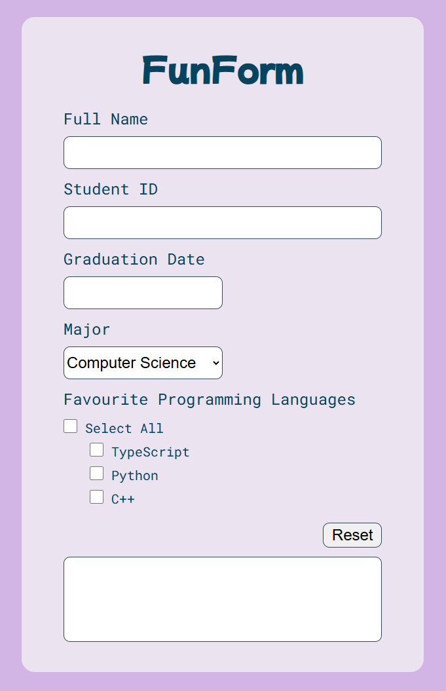

# Changelog

- 05/03: Update output in _1.3. Rendering_ to include Student ID.

# Assessment 2 (Vanilla JS)

[Please see course website for full spec](https://cgi.cse.unsw.edu.au/~cs6080/NOW/assessments/assignments/ass2)

This assignment is due **_Friday the 14th of March, 8pm_**.

Please run `./util/setup.sh` in your terminal before you begin. This will set up some checks in relation to the "Git Commit Requirements".

## Your Task - FunForm

### 1. Overview

The HTML page in `task1/src/index.html` displays a series of inputs, and when valid, outputs a "summary" of this information in the textarea at the bottom of the page.

You are going to make this form dynamic and interactive through use of Javascript only **(Modification or addition of any HTML or CSS is prohibited)**.

#### 1.1. The page

The page consists of a:

- Form
  - Text input for `Full Name` (must be between 3 and 50 characters inclusive).
  - Text input for `Student ID` (valid input must start with a lowercase "z" directly followed by 7 numbers. This means it must match the regex expression "^z[0-9]{7}$").
  - Text input for `Graduation Date` (valid input is the exact format "DD/MM/YYYY" and must be a valid date. This means it must match the regex expression "[0-9]{2}/[0-9]{2}/[0-9]{4}" and when trying to parse it with the Javascript date object it does not return NaN).
  - Dropdown for `Major`(Computer Science (default), Software Engineering, Computer Engineering, and Information Systems).
  - Checkbox for `Favourite Programming Languages` (TypeScript, Python, and C++).
  - Checkbox to `Select All`.
- `Reset` button
- Textarea (initially blank)

#### 1.2. Actions

The following are events that trigger a render that should be binded to particular actions

- Blur of the `Full Name`, `Graduation Date`, or `StudentID` should trigger a render.
- Changing of the `Major`, or `Favourite Programming Languages` should trigger a render.

There are key buttons on the page:

- When the `Select All` checkbox is checked, all three programming languages checkboxes are selected.
  - At any time when all 3 programming languages are selected, the `Select All` checkbox is checked.
  - At any time when one of the checkboxes are deselected, the `Select All` checkbox is unchecked.
- When `selectAll` is unchecked, all three checkboxes are unchecked.
- When the `Reset` button is clicked, the `textarea` has all of its text removed (i.e. it becomes blank again), and all of the form elements are reset to their default state.

#### 1.3. Rendering

The "output" refers to what the inner text should be of the textarea at the bottom of the page.

- If they haven't inputted a `Full Name`, or the `Full Name` entered is invalid, the output should be _"Please input a valid full name"_
- If they have inputted a `Full Name`, but haven't inputted a `Student ID` / the `Student ID` is invalid, the output should be _"Please input a valid student ID"_
- If they have inputted a `Full Name` and `Student ID`, but haven't inputted a `Graduation Date` / the `Graduation Date` is invalid, the output should be _"Please input a valid graduation date"_
- If they have entered the above correctly, the output is _"My name is [Full Name] ([Student ID]), and I [graduate/graduated] [days_since/until_graduation]. I [major/majored] in [Major], and [favourite programming languages]."_
  - If the `Graduation Date` is in the future,
    - [graduate/graduated] is _"graduate"_
    - [days_since/until_graduation] is _"in [X] days"_, where X is equal to the number of days between now and the `Graduation Date` regardless of time of day.
    - [major/majored] is _"major"_
  - If the `Graduation Date` is in the past,
    - [graduate/graduated] is _"graduated"_
    - [days_since/until_graduation] is _"[X] days ago"_, where X is equal to the number of days between now and the `Graduation Date` regardless of time of day.
    - [major/majored] is _"majored"_
  - If the `Graduation Date` is today,
    - [graduate/graduated] is _"graduate"_
    - [days_since/until_graduation] is _"today"_
    - [major/majored] is _"major"_
  - If no programming language is selected, [favourite programming languages] is _"I have no favourite programming language"_
  - If 1 programming language is selected, [favourite programming languages] is _"my favourite programming language is [language1]"_
  - If 2 programming languages are selected, [favourite programming languages] is _"my favourite programming languages are [language1], and [language2]"_
  - If more than 2 programming languages are selected, [favourite programming languages] is _"my favourite programming languages are [language1], [language2], and [language3]"_ etc, where ", and" joins the last and second last programming language.

### 2. Getting started

This task requires you to modify `src/script.js` and **only** this file. Everything is done in this file. **Do NOT modify the HTML or CSS file**.

### 3. Sample outputs

The following are sample outputs for different valid combinations of value entries into the form.

1. My name is Eddy (z5301234), and I graduated 100 days ago. I majored in Computer Science, and my favourite programming language is TypeScript.

2. My name is Kate (z5501310), and I graduate in 10 days. I major in Software Engineering, and my favourite programming languages are TypeScript, and Python.

3. My name is Hayden Smith (z0000001), and I graduate in 1 days. I major in Computer Engineering, and I have no favourite programming language.

4. My name is Eckles (z9999999), and I graduated 1 days ago. I majored in Information Systems, and my favourite programming languages are TypeScript, and C++.

5. My name is H@yden_Eckle$ (z1234567), and I graduate today. I major in Computer Science, and my favourite programming languages are TypeScript, Python, and C++.

Ensure that your output in the textarea matches the **spacing, letter casing and wording** for each of the examples provided. Also note that programming languages are listed in order of their checkbox.

Please note: programming languages are listed in order of how we describe them, NOT in the order they are clicked. Regardless of the order they were clicked the output will follow the same pattern.

You need to write Javascript (typically a combination of event listeners and DOM manipulations) that listen for actions described in `1.2` and render the page described in `1.3` in conjunction with any constraints described in `1.1`.
